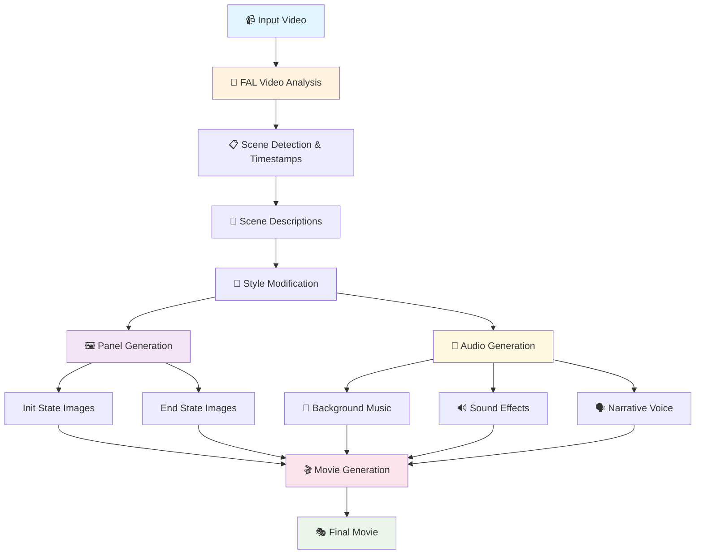

# 🎬 Cinemanga - AI-Powered Multimedia Platform

**Transform content into cinematic experiences with AI**

Cinemanga is a comprehensive AI-powered platform that offers multiple content transformation capabilities:
- **Script-to-Comic**: Convert screenplay scripts into dynamic manga-style comics with synchronized audio
- **Video Analysis**: Extract scenes and understand video content using advanced AI
- **Panel Animation**: Generate smooth transitions between comic panel states
- **Video-to-Manga Pipeline**: Transform existing videos into stylized manga movies with enhanced audio

## 🔄 Complete Pipeline Overview



### Pipeline Stages:

1. **🎥 Video Input & Analysis**: FAL AI processes the original video to understand scenes and content
2. **📋 Scene Detection**: Extract key scenes with precise timestamps and descriptions
3. **🎨 Style Modification**: Apply manga/anime styling preferences to scene descriptions
4. **🖼️ Panel Generation**: Create manga-style panels for each scene (init/end states)
5. **🎵 Audio Enhancement**: Generate contextual music, SFX, and narrative voice-over
6. **🎬 Movie Synthesis**: Combine styled panels with enhanced audio into final cinematic experience

## ✨ Features

### 🖼️ **Visual Generation**
- **Panel Instructions**: AI-generated detailed storyboard instructions for each panel
- **Comic Panels**: High-quality manga-style image generation with dramatic shading
- **Panel Animation**: Smooth transitions between init and end panel states using AI video generation

### 🎥 **Video Understanding**
- **Scene Detection**: Intelligent extraction of key scenes from video content
- **Timestamp Analysis**: Automatic identification of scene transitions with precise timing
- **Content Summarization**: AI-powered analysis and description of video content
- **Multiple Format Support**: Process various video formats (MP4, AVI, MOV, MKV, WebM, etc.)

### 🎵 **Audio Generation**
- **Music**: Contextual background music for each panel
- **Sound Effects**: Scene-appropriate SFX (footsteps, explosions, ambient sounds)
- **Narrative Audio**: Text-to-speech with intelligent voice selection:
  - Elderly characters → Elderly voice
  - Female characters → Female voice  
  - Male characters → Male voice
  - Narrator/SFX → Narrator voice

### 🎭 **Intelligent Processing**
- **Script Analysis**: Converts screenplays into structured panel sequences
- **Scene Understanding**: AI interprets visual and emotional context
- **Voice Selection**: Automatic character voice assignment based on narrative content
- **Timestamped Output**: Organized file structure with timestamps

## 🚀 Quick Start

### Prerequisites

- Docker & Docker Compose
- API Keys:
  - **Google Gemini API Key** (for script analysis and audio cue generation)
  - **ElevenLabs API Key** (for audio generation)
  - **FAL AI API Key** (for image generation)

### 1. Clone Repository

```bash
git clone https://github.com/your-username/cinemanga.git
cd cinemanga
```

### 2. Environment Setup

Create a `.env` file in the project root:

```env
# Required API Keys
GEMINI_API_KEY=your_gemini_api_key_here
ELEVEN_API_KEY=your_elevenlabs_api_key_here
FAL_KEY=your_fal_ai_key_here

# Optional Configuration
BACKEND_PORT=8000
DEBUG=true
GEMINI_MODEL=gemini-2.5-flash
GEMINI_TEMPERATURE=0.6

# Audio Configuration (Optional)
DEFAULT_MUSIC_FORMAT=mp3
DEFAULT_SFX_FORMAT=wav
DEFAULT_NARRATIVE_FORMAT=mp3
VOICE_STABILITY=0.5
VOICE_SIMILARITY_BOOST=0.5

# Voice IDs (Optional - uses defaults if not provided)
DEFAULT_NARRATOR_VOICE=pNInz6obpgDQGcFmaJgB
DEFAULT_MALE_VOICE=TxGEqnHWrfWFTfGW9XjX
DEFAULT_FEMALE_VOICE=21m00Tcm4TlvDq8ikWAM
DEFAULT_ELDERLY_VOICE=VR6AewLTigWG4xSOukaG
```

### 3. Run with Docker

```bash
# Start the application
docker-compose up --build

# Or run in background
docker-compose up -d --build
```

The API will be available at `http://localhost:8000`

### 4. Monitor Logs

```bash
# Follow logs in real-time
docker-compose logs -f backend

# Show recent logs
docker-compose logs --tail=100 backend
```

## 📖 API Usage

### Comic Generation

#### Generate Multimedia Comic

**Endpoint:** `POST /api/generate-multimedia-comic`

```bash
curl -X 'POST' \
  'http://localhost:8000/api/generate-multimedia-comic' \
  -H 'accept: application/json' \
  -H 'Content-Type: application/json' \
  -d '{
  "script": "FADE IN:\nA hero stands on a cliff overlooking the city at sunset.\nHe takes a deep breath and leaps into action.",
  "style": "manga style, black and white with dramatic shading"
}'
```

**Response:**
```json
{
  "panels": [...],
  "audio": [...],
  "output_directory": "/app/audio-assets-20241220-143052",
  "panel_count": 3,
  "audio_files_count": 3,
  "type": "multimedia_comic",
  "status": "success"
}
```

#### Generate Audio Only

**Endpoint:** `POST /api/generate-audio-cues`

```bash
curl -X 'POST' \
  'http://localhost:8000/api/generate-audio-cues' \
  -H 'accept: application/json' \
  -H 'Content-Type: application/json' \
  -d '{
  "script": "Your script here...",
  "style": "manga style"
}'
```

#### Generate Comic Only

**Endpoint:** `POST /api/generate-comic-draft`

```bash
curl -X 'POST' \
  'http://localhost:8000/api/generate-comic-draft' \
  -H 'accept: application/json' \
  -H 'Content-Type: application/json' \
  -d '{
  "script": "Your script here...",
  "style": "manga style"
}'
```

### Video Analysis

#### Upload and Analyze Video

**Endpoint:** `POST /api/upload`

```bash
curl -X 'POST' \
  'http://localhost:8000/api/upload' \
  -H 'accept: application/json' \
  -F 'file=@your_video.mp4'
```

**Response:**
```json
{
  "status": "processing",
  "message": "Video uploaded successfully, processing started",
  "result_id": "upload_20241220_143052_video.mp4"
}
```

#### Process Video from URL

**Endpoint:** `POST /api/process-url`

```bash
curl -X 'POST' \
  'http://localhost:8000/api/process-url' \
  -H 'accept: application/json' \
  -H 'Content-Type: application/json' \
  -d '{
  "url": "https://example.com/video.mp4"
}'
```

#### Check Processing Status

**Endpoint:** `GET /api/status/{result_id}`

```bash
curl http://localhost:8000/api/status/upload_20241220_143052_video.mp4
```

#### Get Analysis Results

**Endpoint:** `GET /api/results/{result_id}`

```bash
curl http://localhost:8000/api/results/upload_20241220_143052_video.mp4
```

**Response:**
```json
{
  "result_id": "upload_20241220_143052_video.mp4",
  "video_name": "video.mp4",
  "video_url": "https://...",
  "analysis_results": {...},
  "extracted_scenes": [...],
  "total_scenes": 5,
  "processed_at": 1703087452.123,
  "status": "completed"
}
```

### Health Check

**Endpoint:** `GET /api/health`

```bash
curl http://localhost:8000/api/health
```

## 📁 Output Structure

Each generation creates a timestamped directory with organized files:

```
audio-assets-20241220-143052/
├── panel01_music.mp3      # Background music
├── panel01_sfx.wav        # Sound effects
├── panel01_narrative.mp3  # Voice narration
├── panel02_music.mp3
├── panel02_sfx.wav
├── panel02_narrative.mp3
└── ...
```

## 🔧 Development

### Project Structure

```
cinemanga/
├── backend/                 # FastAPI backend
│   ├── modules/            # Core functionality
│   │   ├── comic_generator.py      # Panel generation & instructions
│   │   ├── storyboard_to_audio.py  # Audio generation (music, SFX, TTS)
│   │   ├── movie_generator.py      # Panel animation generation
│   │   └── fal_scene_detector.py   # Video analysis & scene detection
│   ├── routers.py          # Comic generation API endpoints
│   ├── main.py            # FastAPI application with video analysis endpoints
│   └── requirements.txt   # Python dependencies
├── compose.yaml           # Docker Compose configuration
└── README.md             # This file
```

### Local Development

1. **Install Dependencies:**
```bash
cd backend
pip install -r requirements.txt
```

2. **Run Development Server:**
```bash
# With environment variables
export GEMINI_API_KEY=your_key
export ELEVEN_API_KEY=your_key
export FAL_KEY=your_key

# Start server
uvicorn main:app --reload --port 8000
```

3. **API Documentation:**
Visit `http://localhost:8000/docs` for interactive API documentation.

### Technical Architecture

```mermaid
graph LR
    subgraph "Input Sources"
        A1[📄 Script Text]
        A2[📹 Video File/URL]
    end
    
    subgraph "AI Processing Services"
        B1[🧠 Google Gemini]
        B2[🎨 FAL AI]
        B3[🎵 ElevenLabs]
    end
    
    subgraph "Core Modules"
        C1[comic_generator.py]
        C2[fal_scene_detector.py]
        C3[storyboard_to_audio.py]
        C4[movie_generator.py]
    end
    
    subgraph "API Endpoints"
        D1[/api/generate-multimedia-comic]
        D2[/api/upload & /api/process-url]
        D3[/api/generate-audio-cues]
    end
    
    subgraph "Output"
        E1[🖼️ Manga Panels]
        E2[🎵 Audio Files]
        E3[🎬 Video Animations]
        E4[📊 Scene Analysis]
    end
    
    A1 --> D1
    A2 --> D2
    
    D1 --> C1
    D2 --> C2
    D1 --> C3
    D3 --> C3
    
    C1 --> B1
    C1 --> B2
    C2 --> B2
    C3 --> B1
    C3 --> B3
    C4 --> B2
    
    C1 --> E1
    C2 --> E4
    C3 --> E2
    C4 --> E3
    
    style B1 fill:#e3f2fd
    style B2 fill:#f3e5f5
    style B3 fill:#fff8e1
```

### Code Structure

#### **Comic Generation Pipeline:**
1. `generate_panel_instructions()` - Script → Panel instructions via Gemini
2. `generate_comic()` - Panel instructions → Images via FAL AI
3. `generate_audio_from_panel_instructions()` - Panel instructions → Audio via Gemini + ElevenLabs
4. `generate_movie_from_panels()` - Panel transitions → Animation via FAL AI

#### **Video Analysis Pipeline:**
1. `upload_video()` / `process_video_url()` - Upload or process video from URL
2. `analyze_video_scenes()` - Extract scene descriptions and timestamps via FAL AI
3. `extract_scene_timestamps()` - Parse timestamps and create structured scene data
4. Background processing with real-time status updates

#### **Audio Generation Components:**
- **Music/SFX Cues**: Gemini analyzes script context to generate audio prompts
- **Sound Generation**: ElevenLabs creates music and sound effects
- **Text-to-Speech**: ElevenLabs converts narrative text to speech with voice selection
- **Voice Selection**: `select_voice_for_narrative()` automatically chooses appropriate voices

### Configuration

The system uses a Pydantic-based configuration system (`AudioGenerationConfig`) that supports:
- Environment variable configuration
- Programmatic overrides
- Validation and type checking
- Testing configurations

### Adding New Features

1. **New Audio Types**: Extend the `audio_types` parameter in generation functions
2. **Voice Selection**: Modify `select_voice_for_narrative()` for new voice logic
3. **File Formats**: Add support in `validate_audio_formats()`
4. **API Endpoints**: Add new routes in `routers.py`

## 🎯 Use Cases

### Comic Generation
- **Content Creators**: Transform scripts into visual stories with synchronized audio
- **Educators**: Create engaging educational comics and interactive content
- **Game Developers**: Generate cutscene storyboards and concept animations
- **Film Pre-production**: Visualize scenes and test transitions before shooting
- **Accessibility**: Convert visual content to audio formats with voice narration

### Video Analysis
- **Content Analysis**: Extract key scenes and moments from video content
- **Education**: Analyze educational videos for key learning segments
- **Media Production**: Identify important scenes for editing and post-production
- **Research**: Understand video content structure and narrative flow
- **Accessibility**: Generate scene descriptions for visually impaired users

## 🔊 Audio Voice Selection

The system automatically selects appropriate voices based on narrative content:

| Content Type | Voice Selection | Example |
|-------------|----------------|---------|
| Elderly characters | Elderly voice | "ELDERLY MAN: Hello" |
| Female characters | Female voice | "She whispered softly" |
| Male characters | Male voice | "He shouted loudly" |
| Sound effects | Narrator voice | "SFX: clatter... slurp" |
| General narration | Narrator voice | "Meanwhile, across town..." |

## 🐛 Troubleshooting

### Common Issues

1. **"Not Found" Error**
   - Check that API keys are set in `.env`
   - Verify the correct endpoint URLs with `/api` prefix

2. **JSON Parsing Errors**
   - The system includes automatic JSON repair
   - Check logs for detailed error information

3. **Audio Generation Fails**
   - Verify ElevenLabs API key and quota
   - Check voice IDs are valid

4. **Image Generation Fails**
   - Verify FAL AI API key and credits
   - Check script content isn't too complex

### Debug Logging

Enable detailed logging to troubleshoot issues:

```bash
# Follow logs with verbose output
docker-compose logs -f backend | grep -E "(ERROR|WARN|DEBUG)"
```

## 🤝 Contributing

### Setting Up Development Environment

1. **Fork the repository**
2. **Create feature branch**: `git checkout -b feature/amazing-feature`
3. **Set up environment**: Follow development setup above
4. **Make changes**: Implement your feature
5. **Test thoroughly**: Ensure all endpoints work
6. **Commit changes**: `git commit -m 'Add amazing feature'`
7. **Push to branch**: `git push origin feature/amazing-feature`
8. **Open Pull Request**

### Code Style

- Follow PEP 8 for Python code
- Use type hints throughout
- Add docstrings for new functions
- Include error handling
- Add logging for debugging

### Testing

```bash
# Run basic import tests
cd backend
python -c "import routers; print('✓ Router imports successfully')"
python -c "from modules.storyboard_to_audio import generate_audio_from_panel_instructions; print('✓ Audio module imports successfully')"
```

### Adding New Endpoints

1. Define request/response models in `routers.py`
2. Add endpoint with proper logging
3. Update this README with usage examples
4. Test with curl commands

## 📋 Requirements

### System Requirements
- Docker & Docker Compose
- 4GB+ RAM recommended
- Internet connection for AI API calls

### API Dependencies
- **Google Gemini**: Script analysis and audio cue generation
- **ElevenLabs**: Audio generation (music, SFX, TTS)
- **FAL AI**: Image generation, video analysis, and panel animation

### Python Dependencies
See `backend/requirements.txt` for complete list:
- FastAPI
- Uvicorn
- Google GenAI
- ElevenLabs SDK
- FAL Client
- Pydantic
- Python-slugify

## 📜 License

This project is licensed under the Apache License 2.0 - see the [LICENSE](LICENSE) file for details.

## 🙏 Acknowledgments

- **Google Gemini** for advanced script analysis and content understanding
- **ElevenLabs** for high-quality audio generation and text-to-speech
- **FAL AI** for manga-style image generation, video analysis, and animation
- **FastAPI** for the robust API framework and async processing

---

**🎬 Ready to create your multimedia manga? Get started now!**

For questions, issues, or contributions, please open an issue on GitHub.
