# 🎬 Cinemanga - AI-Powered Multimedia Platform

**Transform content into cinematic experiences with AI**

Cinemanga is a comprehensive AI-powered platform that combines cutting-edge AI models to create multimedia storytelling experiences:

- **🎨 Script-to-Comic**: Convert screenplay scripts into dynamic styled comics using FAL AI's nano-banana model
- **🎵 Synchronized Audio**: Generate contextual music, sound effects, and narrative voice-over with ElevenLabs
- **🧠 Intelligent Analysis**: Advanced script understanding and scene breakdown with Google Gemini
- **📹 Video Analysis**: Extract scenes and understand video content using FAL AI's video understanding
- **🎬 Panel Animation**: Generate smooth transitions between comic panel states
- **🔗 Integrated Pipeline**: Seamless connection between visual generation, audio synthesis, and content analysis

## 🔄 Complete Pipeline Overview

```mermaid
graph TD
    A[📝 Script Input] --> B[🧠 Gemini Analysis]
    B --> C[📋 Panel Instructions]
    C --> D[🍌 FAL Nano-Banana]
    D --> E[🖼️ Comic Panels]
    
    C --> F[🧠 Gemini Audio Cues]
    F --> G[🎵 ElevenLabs Audio]
    
    H[📹 Video Input] --> I[🎥 FAL Video Analysis]
    I --> J[📊 Scene Extraction]
    J --> K[📝 Scene Descriptions]
    K --> B
    
    E --> L[🎬 Multimedia Comic]
    G --> L
    
    G --> G1[🎼 Background Music]
    G --> G2[🔊 Sound Effects]
    G --> G3[🗣️ Narrative Voice]
    
    style D fill:#fff3e0,stroke:#ff9800,stroke-width:3px
    style B fill:#e3f2fd
    style G fill:#fff8e1
    style L fill:#e8f5e8
    style I fill:#f3e5f5
```



### Pipeline Stages:

#### **📝 Script-to-Comic Pipeline:**
1. **🧠 Gemini Analysis**: Intelligent script parsing and panel instruction generation
2. **🍌 FAL Nano-Banana**: High-quality custom-style image generation with panel continuity
3. **🧠 Gemini Audio Cues**: Context-aware audio prompt generation for each panel
4. **🎵 ElevenLabs Synthesis**: Multi-modal audio generation (music, SFX, voice narration)
5. **🔗 Integration**: Synchronized multimedia comic with timestamped audio assets

#### **📹 Video Analysis Pipeline:**
1. **🎥 FAL Video Understanding**: Advanced scene detection and content analysis
2. **📊 Scene Extraction**: Intelligent timestamp identification and scene breakdown
3. **📝 Content Description**: AI-powered scene summarization and context understanding
4. **🔄 Pipeline Integration**: Feed extracted scenes into script-to-comic pipeline

#### **🎨 Visual Generation Features:**
- **Panel Continuity**: nano-banana/edit mode maintains visual consistency between panels
- **Style Adaptation**: custom styling with dramatic shading and composition
- **Sequential Generation**: Context-aware panel creation using previous panel information

## ✨ Features

### 🖼️ **Visual Generation (FAL AI Nano-Banana)**
- **Style Generation**: Specialized model optimized for image gen
- **Panel Continuity**: Advanced edit mode maintains visual consistency across sequential panels
- **Style Processing**: Handles complex style instructions (black & white, dramatic shading, composition)
- **Context Awareness**: Uses previous panel information to create coherent visual narratives
- **High-Quality Output**: Professional-grade artwork generation

### 🎥 **Video Understanding (FAL AI Video Analysis)**
- **Advanced Scene Detection**: AI-powered extraction of key scenes with contextual understanding
- **Timestamp Analysis**: Precise identification of scene transitions and important moments
- **Content Summarization**: Intelligent analysis and description of video narrative structure
- **Multiple Format Support**: Process various video formats (MP4, AVI, MOV, MKV, WebM, etc.)
- **Real-time Processing**: Background analysis with status updates and progress tracking

### 🎵 **Audio Generation (ElevenLabs + Gemini)**
- **Context-Aware Music**: Gemini analyzes panel mood to generate appropriate background music prompts
- **Dynamic Sound Effects**: Scene-appropriate SFX generation (footsteps, explosions, ambient sounds)
- **Intelligent Voice Narration**: Automatic voice selection and text-to-speech:
  - Elderly characters → Elderly voice profile
  - Female characters → Female voice profile  
  - Male characters → Male voice profile
  - Narrator/SFX → Professional narrator voice
- **Synchronized Output**: Timestamped audio files that align with visual panels
- **Multi-Format Support**: Configurable output formats (MP3, WAV, etc.) for different use cases

### 🎭 **Intelligent Processing (Google Gemini)**
- **Advanced Script Analysis**: Converts screenplays into detailed, structured panel sequences
- **Contextual Understanding**: AI interprets visual, emotional, and narrative context
- **Audio Cue Generation**: Analyzes scene context to create appropriate music and SFX prompts
- **Voice Assignment Logic**: Automatic character voice selection based on narrative content analysis
- **Panel Instruction Generation**: Creates detailed visual instructions for panel creation
- **Pydantic Configuration**: Type-safe, validated configuration management with environment variable support

## 🚀 Quick Start

### Prerequisites

- Docker & Docker Compose
- API Keys:
  - **Google Gemini API Key** (for script analysis and audio cue generation)
  - **ElevenLabs API Key** (for audio synthesis - music, SFX, voice narration)
  - **FAL AI API Key** (for nano-banana image generation and video analysis)

### 1. Clone Repository

```bash
git clone https://github.com/your-username/cinemanga.git
cd cinemanga
```

### 2. Environment Setup

Create a `.env` file in the project root:

```env
# Required API Keys
GEMINI_API_KEY=your_gemini_api_key_here
ELEVEN_API_KEY=your_elevenlabs_api_key_here
FAL_KEY=your_fal_ai_key_here

# Optional Configuration
BACKEND_PORT=8000
DEBUG=true
GEMINI_MODEL=gemini-2.5-flash
GEMINI_TEMPERATURE=0.6

# Audio Configuration (Optional)
DEFAULT_MUSIC_FORMAT=mp3
DEFAULT_SFX_FORMAT=wav
DEFAULT_NARRATIVE_FORMAT=mp3
VOICE_STABILITY=0.5
VOICE_SIMILARITY_BOOST=0.5

# Voice Configuration (Optional - uses defaults if not provided)
DEFAULT_NARRATOR_VOICE=pNInz6obpgDQGcFmaJgB
DEFAULT_MALE_VOICE=TxGEqnHWrfWFTfGW9XjX
DEFAULT_FEMALE_VOICE=21m00Tcm4TlvDq8ikWAM
DEFAULT_ELDERLY_VOICE=VR6AewLTigWG4xSOukaG
VOICE_STABILITY=0.5
VOICE_SIMILARITY_BOOST=0.5

# ElevenLabs API Configuration
ELEVEN_TTS_URL=https://api.elevenlabs.io/v1/text-to-speech

# Output Format Configuration
DEFAULT_NARRATIVE_FORMAT=mp3
```

### 3. Run with Docker

```bash
# Start the application
docker-compose up --build

# Or run in background
docker-compose up -d --build
```

The API will be available at `http://localhost:8000`

### 4. Monitor Logs

```bash
# Follow logs in real-time
docker-compose logs -f backend

# Show recent logs
docker-compose logs --tail=100 backend
```

## 📖 API Usage

### Comic Generation

#### Generate Multimedia Comic

**Endpoint:** `POST /generate-multimedia-comic`

```bash
curl -X 'POST' \
  'http://localhost:8000/generate-multimedia-comic' \
  -H 'accept: application/json' \
  -H 'Content-Type: application/json' \
  -d '{
  "script": "FADE IN:\nA hero stands on a cliff overlooking the city at sunset.\nHe takes a deep breath and leaps into action.",
  "style": "manga style, black and white with dramatic shading"
}'
```

**Response:**
```json
{
  "panels": [
    {
      "panel_number": 1,
      "instructions": "Hero standing on cliff...",
      "init_state_instructions": "Hero standing still...",
      "narrative": "A hero contemplates the city below",
      "image_url": "https://fal.media/files/...",
      "movie": {
        "status": "success",
        "movie_path": "./output/comic_20241220_143052/panel_01_movie.mp4",
        "movie_url": "https://fal.media/files/..."
      },
      "status": "success"
    }
  ],
  "audio": [
    {
      "panel_number": 1,
      "files": [
        {"type": "music", "path": "./audio-assets-20241220-143052/panel01_music.mp3"},
        {"type": "sfx", "path": "./audio-assets-20241220-143052/panel01_sfx.wav"},
        {"type": "narrative", "path": "./audio-assets-20241220-143052/panel01_narrative.mp3"}
      ]
    }
  ],
  "output_directory": "./audio-assets-20241220-143052",
  "panel_count": 3,
  "audio_files_count": 3,
  "type": "multimedia_comic",
  "status": "success"
}
```

#### Generate Audio Only

**Endpoint:** `POST /generate-audio-cues`

```bash
curl -X 'POST' \
  'http://localhost:8000/generate-audio-cues' \
  -H 'accept: application/json' \
  -H 'Content-Type: application/json' \
  -d '{
  "script": "FADE IN: A hero stands on a cliff at sunset.",
  "style": "manga style"
}'
```

#### Generate Comic Only (Visual Panels)

**Endpoint:** `POST /generate-comic-draft`

```bash
curl -X 'POST' \
  'http://localhost:8000/generate-comic-draft' \
  -H 'accept: application/json' \
  -H 'Content-Type: application/json' \
  -d '{
  "script": "FADE IN: A hero stands on a cliff at sunset.",
  "style": "manga style"
}'
```

### Video Analysis

#### Upload and Analyze Video

**Endpoint:** `POST /api/upload`

```bash
curl -X 'POST' \
  'http://localhost:8000/api/upload' \
  -H 'accept: application/json' \
  -F 'file=@your_video.mp4'
```

**Response:**
```json
{
  "status": "processing",
  "message": "Video uploaded successfully, processing started",
  "result_id": "upload_20241220_143052_video.mp4"
}
```

#### Process Video from URL

**Endpoint:** `POST /api/process-url`

```bash
curl -X 'POST' \
  'http://localhost:8000/api/process-url' \
  -H 'accept: application/json' \
  -H 'Content-Type: application/json' \
  -d '{
  "url": "https://example.com/video.mp4"
}'
```

#### Check Processing Status

**Endpoint:** `GET /api/status/{result_id}`

```bash
curl http://localhost:8000/api/status/upload_20241220_143052_video.mp4
```

#### Get Analysis Results

**Endpoint:** `GET /api/results/{result_id}`

```bash
curl http://localhost:8000/api/results/upload_20241220_143052_video.mp4
```

**Response:**
```json
{
  "result_id": "upload_20241220_143052_video.mp4",
  "video_name": "video.mp4",
  "video_url": "https://...",
  "analysis_results": {...},
  "extracted_scenes": [...],
  "total_scenes": 5,
  "processed_at": 1703087452.123,
  "status": "completed"
}
```

### Health Check

**Endpoint:** `GET /api/health`

```bash
curl http://localhost:8000/api/health
```

## 📁 Output Structure

Each generation creates a timestamped directory with organized files:

```
audio-assets-20241220-143052/
├── panel01_music.mp3      # Background music
├── panel01_sfx.wav        # Sound effects
├── panel01_narrative.mp3  # Voice narration
├── panel02_music.mp3
├── panel02_sfx.wav
├── panel02_narrative.mp3
└── ...
```

## 🔧 Development

### Project Structure

```
cinemanga/
├── backend/                 # FastAPI backend
│   ├── modules/            # Core functionality
│   │   ├── comic_generator.py      # Panel generation & FAL nano-banana integration
│   │   ├── storyboard_to_audio.py  # Audio generation (Gemini + ElevenLabs)
│   │   ├── movie_generator.py      # Panel animation via FAL AI
│   │   ├── audio_mixer.py          # Audio-video synchronization
│   │   └── fal_scene_detector.py   # Video analysis & scene detection
│   ├── routers.py          # Comic generation API endpoints
│   ├── main.py            # FastAPI application with video analysis endpoints
│   ├── static/            # Frontend HTML interface
│   └── requirements.txt   # Python dependencies
├── compose.yaml           # Docker Compose configuration
├── .env.example          # Environment configuration template
└── README.md             # This file
```

### Local Development

1. **Install Dependencies:**
```bash
cd backend
pip install -r requirements.txt
```

2. **Run Development Server:**
```bash
# With environment variables
export GEMINI_API_KEY=your_key
export ELEVEN_API_KEY=your_key
export FAL_KEY=your_key

# Start server
uvicorn main:app --reload --port 8000
```

3. **API Documentation:**
Visit `http://localhost:8000/docs` for interactive API documentation.

### Technical Architecture

```mermaid
graph LR
    subgraph "Input Sources"
        A1[📄 Script Text]
        A2[📹 Video File/URL]
    end
    
    subgraph "AI Processing Services"
        B1[🧠 Google Gemini]
        B2[🎨 FAL AI]
        B3[🎵 ElevenLabs]
    end
    
    subgraph "Core Modules"
        C1[comic_generator.py]
        C2[fal_scene_detector.py]
        C3[storyboard_to_audio.py]
        C4[movie_generator.py]
    end
    
    subgraph "API Endpoints"
        D1["/api/generate-multimedia-comic"]
        D2["/api/upload + /api/process-url"]
        D3["/api/generate-audio-cues"]
    end
    
    subgraph "Output"
        E1[🖼️ Manga Panels]
        E2[🎵 Audio Files]
        E3[🎬 Video Animations]
        E4[📊 Scene Analysis]
    end
    
    A1 --> D1
    A2 --> D2
    
    D1 --> C1
    D2 --> C2
    D1 --> C3
    D3 --> C3
    
    C1 --> B1
    C1 --> B2
    C2 --> B2
    C3 --> B1
    C3 --> B3
    C4 --> B2
    
    C1 --> E1
    C2 --> E4
    C3 --> E2
    C4 --> E3
    
    style B1 fill:#e3f2fd
    style B2 fill:#f3e5f5
    style B3 fill:#fff8e1
```



### Code Structure

#### **Comic Generation Pipeline:**
1. `generate_panel_instructions()` - Script → Detailed panel instructions via Gemini
2. `generate_comic()` - Panel instructions →  images via FAL nano-banana
3. `generate_movie_from_panels()` - Panel transitions → Smooth animations via FAL AI  
4. `generate_audio_from_panel_instructions()` - Panel context → Audio assets via Gemini + ElevenLabs
5. `create_audio_mixed_panels()` - Synchronize audio with panel movies

#### **Video Analysis Pipeline:**
1. `upload_video()` / `process_video_url()` - Upload or process video from URL
2. `analyze_video_scenes()` - Extract scene descriptions and timestamps via FAL AI
3. `extract_scene_timestamps()` - Parse timestamps and create structured scene data
4. Background processing with real-time status updates

#### **Audio Generation Components:**
- **Music/SFX Cues**: Gemini analyzes panel context to generate audio prompts  
- **Sound Generation**: ElevenLabs creates music and sound effects from AI-generated prompts
- **Text-to-Speech**: ElevenLabs converts narrative text to speech with intelligent voice selection
- **Voice Selection**: `select_voice_for_narrative()` automatically chooses voices based on character analysis
- **Audio Synchronization**: `create_audio_mixed_panels()` combines narrative audio with panel movies

### Configuration

The system uses a Pydantic-based configuration system (`AudioGenerationConfig`) that supports:
- Environment variable configuration
- Programmatic overrides
- Validation and type checking
- Testing configurations

### Current Implementation Status

#### ✅ **Fully Implemented Features:**
- **Script-to-Comic Generation**: Complete pipeline from text to panels
- **FAL Nano-Banana Integration**: High-quality style image generation with panel continuity
- **Audio Generation**: Music, SFX, and narrative voice generation via ElevenLabs
- **Video Analysis**: Complete FAL AI video understanding and scene detection
- **Panel Animation**: Smooth transitions between panel states via FAL AI movie generation
- **Audio Synchronization**: Mixing narrative audio with panel movies
- **Pydantic Configuration**: Type-safe, environment-based configuration management

#### 🔗 **API Endpoints Available:**
- `POST /generate-multimedia-comic` - Complete multimedia comic generation
- `POST /generate-comic-draft` - Visual panel generation only
- `POST /generate-audio-cues` - Audio asset generation only
- `POST /api/upload` - Video file upload and analysis
- `POST /api/process-url` - Video URL processing (YouTube, etc.)
- `GET /api/status/{result_id}` - Processing status tracking
- `GET /api/results/{result_id}` - Analysis results retrieval
- `GET /health` - Health check endpoint

### Adding New Features

1. **New Audio Types**: Extend the `audio_types` parameter in generation functions
2. **Voice Selection**: Modify `select_voice_for_narrative()` for new voice logic
3. **File Formats**: Add support in `validate_audio_formats()`
4. **API Endpoints**: Add new routes in `routers.py`
5. **Panel Effects**: Extend nano-banana integration for new visual styles

## 🎯 Use Cases

### Comic Generation
- **Content Creators**: Transform scripts into visual stories with synchronized audio
- **Educators**: Create engaging educational comics and interactive content
- **Game Developers**: Generate cutscene storyboards and concept animations
- **Film Pre-production**: Visualize scenes and test transitions before shooting
- **Accessibility**: Convert visual content to audio formats with voice narration

### Video Analysis
- **Content Analysis**: Extract key scenes and moments from video content
- **Education**: Analyze educational videos for key learning segments
- **Media Production**: Identify important scenes for editing and post-production
- **Research**: Understand video content structure and narrative flow
- **Accessibility**: Generate scene descriptions for visually impaired users

## 🔊 Audio Voice Selection

The system automatically selects appropriate voices based on narrative content:

| Content Type | Voice Selection | Example |
|-------------|----------------|---------|
| Elderly characters | Elderly voice | "ELDERLY MAN: Hello" |
| Female characters | Female voice | "She whispered softly" |
| Male characters | Male voice | "He shouted loudly" |
| Sound effects | Narrator voice | "SFX: clatter... slurp" |
| General narration | Narrator voice | "Meanwhile, across town..." |

## 🐛 Troubleshooting

### Common Issues

1. **"Not Found" Error**
   - Check that API keys are set in `.env`
   - Verify the correct endpoint URLs with `/api` prefix

2. **JSON Parsing Errors**
   - The system includes automatic JSON repair
   - Check logs for detailed error information

3. **Audio Generation Fails**
   - Verify ElevenLabs API key and quota
   - Check voice IDs are valid

4. **Image Generation Fails**
   - Verify FAL AI API key and credits
   - Check script content isn't too complex

### Debug Logging

Enable detailed logging to troubleshoot issues:

```bash
# Follow logs with verbose output
docker-compose logs -f backend | grep -E "(ERROR|WARN|DEBUG)"
```

## 🤝 Contributing

### Setting Up Development Environment

1. **Fork the repository**
2. **Create feature branch**: `git checkout -b feature/amazing-feature`
3. **Set up environment**: Follow development setup above
4. **Make changes**: Implement your feature
5. **Test thoroughly**: Ensure all endpoints work
6. **Commit changes**: `git commit -m 'Add amazing feature'`
7. **Push to branch**: `git push origin feature/amazing-feature`
8. **Open Pull Request**

### Code Style

- Follow PEP 8 for Python code
- Use type hints throughout
- Add docstrings for new functions
- Include error handling
- Add logging for debugging

### Testing

```bash
# Run basic import tests
cd backend
python -c "import routers; print('✓ Router imports successfully')"
python -c "from modules.storyboard_to_audio import generate_audio_from_panel_instructions; print('✓ Audio module imports successfully')"
```

### Adding New Endpoints

1. Define request/response models in `routers.py`
2. Add endpoint with proper logging
3. Update this README with usage examples
4. Test with curl commands

## 📋 Requirements

### System Requirements
- Docker & Docker Compose
- 4GB+ RAM recommended
- Internet connection for AI API calls

### API Dependencies
- **Google Gemini**: Script analysis and audio cue generation
- **ElevenLabs**: Audio generation (music, SFX, TTS)
- **FAL AI**: Image generation, video analysis, and panel animation

### Python Dependencies
See `backend/requirements.txt` for complete list:
- FastAPI
- Uvicorn
- Google GenAI
- ElevenLabs SDK
- FAL Client
- Pydantic
- Python-slugify

## 📜 License

This project is licensed under the Apache License 2.0 - see the [LICENSE](LICENSE) file for details.

## 🙏 Acknowledgments

- **Google Gemini** for advanced script analysis and content understanding
- **ElevenLabs** for high-quality audio generation and text-to-speech
- **FAL AI** for image generation, video analysis, and animation
- **FastAPI** for the robust API framework and async processing

---

**🎬 Ready to create your multimedia movies? Get started now!**

For questions, issues, or contributions, please open an issue on GitHub.
